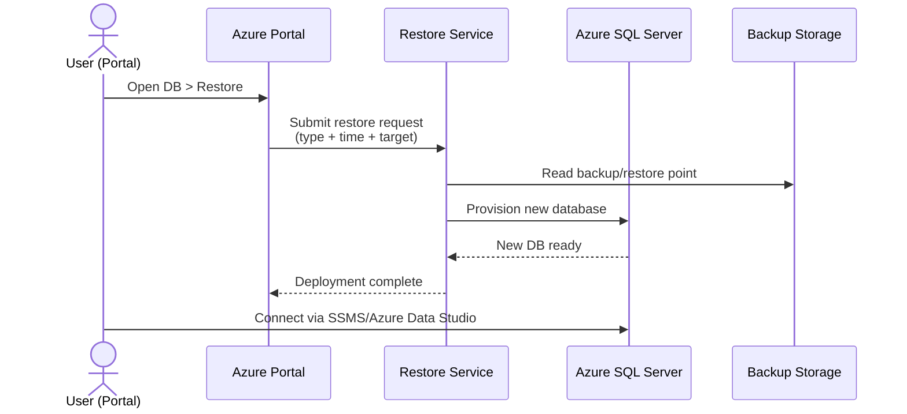

# Setup Guide: Restore SQL Database in Azure

## Overview

This guide explains how to restore a SQL database in Microsoft Azure using the Azure Portal.  
It covers prerequisites, architecture, step-by-step instructions, verification, and common issues.

**Audience:** Cloud administrators, database administrators, and support engineers  
**Skill Level:** Beginner–Intermediate  

---

## Prerequisites

- An active Azure subscription  
- Access to the Azure Portal with sufficient permissions  
- An existing Azure SQL Server instance  
- A database backup available (automated backup, geo-redundant, or long-term retention)  

---

## Architecture at a Glance

!!! note "Key Concepts"
    - **Backups** are stored in Azure-managed storage.  
    - **Restore** creates a **new database**; it does not overwrite the source.  
    - **Point-in-time restore (PITR)** is typically fastest.  
    - **Geo-restore** and **Long-term retention (LTR)** restores can take longer, depending on size and region.

### Flow Diagram

```mermaid
flowchart LR
    A[Automated / LTR Backups] -->|Point-in-time / Geo / LTR| B[(Azure Backup Storage)]
    B --> C[Azure Portal: Restore]
    C --> D{Choose Restore Type}
    D -->|Point-in-time| E[Create New Database<br/>(Same Server or Different Server)]
    D -->|Geo-restore| E
    D -->|Long-term retention| E
    E --> F[(Deployed Restored DB)]
    F --> G[Validate: Portal, SSMS, Azure Data Studio]
```

### Sequence Diagram



---

## Steps

### 1) Sign in to Azure

- Go to <https://portal.azure.com> and sign in.

### 2) Locate the Source Database

- In the left menu, select **SQL databases**.
- Click the database you want to restore.

### 3) Start a Restore

- On the database **Overview** page, select **Restore**.
- Choose the restore source:
  - **Point-in-time** (from automated backups)
  - **Geo-restore** (from geo-redundant backup)
  - **Long-term retention (LTR)** (from archived backups)

### 4) Configure Restore Options

- Enter a **new database name** (must be unique).
- Select the **target server** and resource group.
- (Optional) Adjust **compute/storage** tier for the restored DB.

### 5) Deploy the Restore

- Click **Review + create** → **Create**.
- Wait for the deployment to complete (time varies by size/type).

---

## Verification

1. In **SQL databases**, confirm the **restored database** appears.
2. Connect using **SQL Server Management Studio (SSMS)** or **Azure Data Studio**.
3. Validate schema and data (spot-check key tables).

---

## Common Issues & Fixes

- **“Database name already exists.”** → Use a unique name for the restored database.  
- **Insufficient permissions.** → Ensure your account has *Contributor* or *SQL DB Contributor* role.  
- **Restore seems slow.** → Large DBs, geo-restores, or LTR restores can take hours depending on region/size.  
- **Cannot connect after restore.** → Update **firewall rules** on the SQL Server to allow your client IPs.  

---

## References

- Microsoft Docs — **Restore a database in Azure SQL Database**: <https://learn.microsoft.com/en-us/azure/azure-sql/database/recovery-using-backups>  
- **Azure Portal**: <https://portal.azure.com>
